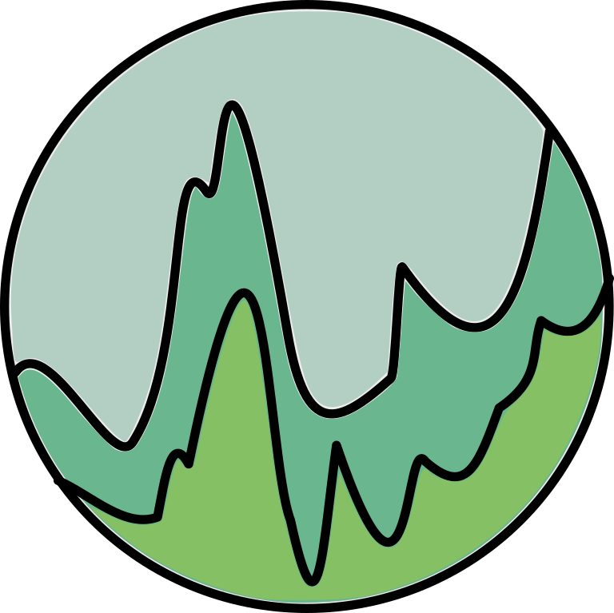
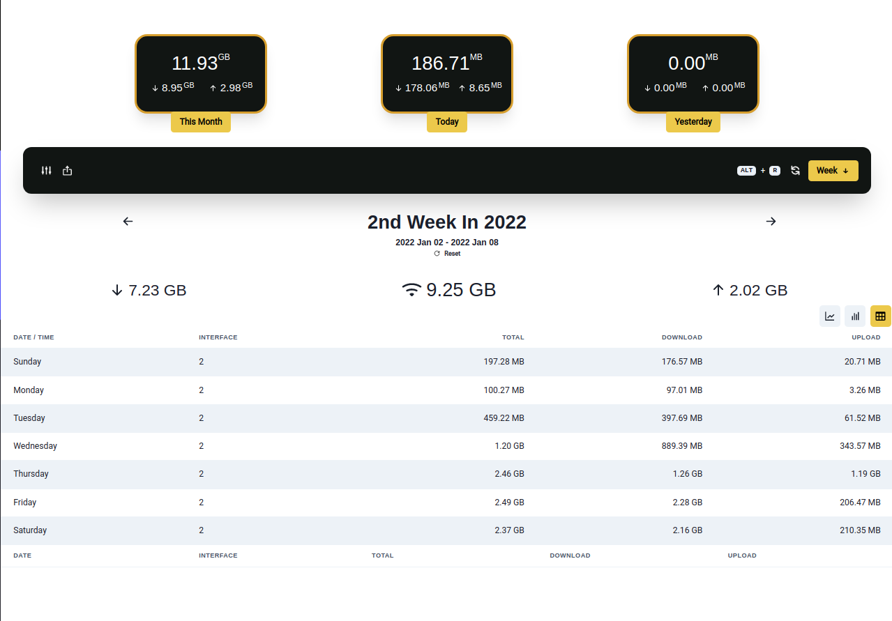

  <h1 align='center'>vnStat Client</h1> 

<h3 align='center'> GUI Client for <a href='https://github.com/vergoh/vnstat'>vnStat traffic monitor</a> built with <a href='https://github.com/saltyshiomix/nextron/tree/v7.1.0'>Nextron</a> </h3>

## Requirements

- [vnStat (^2.8)](https://github.com/vergoh/vnstat)

---

## Features

- Display statistics for your usage for different intervals
  - Daily
  - Weekly
  - Monthly
  - Yearly
  - Custom Interval you choose
- Different types of stats display
  - Bar Chart
  - Line Chart
  - Table
- Export all information as:
  - CSV
  - XML
  - JSON
- Beautiful UI (Thanks [Chakra UI](https://chakra-ui.com/) for this great UI components library)
- Different themes and color schemes for UI and Charts (Line/Bar Chart and Thanks for [Nivo](https://nivo.rocks/) for great charts library)
- Full controlling in vnStat Daemon (Support systemd only)
- Easy changing vnStat's configurations

And more!

## Installation

> Please check [INSTALLATION.md](./INSTALLATION.md)

---

## Screenshots

Show [More](screenshots).

---

## Credits

- Thanks [vergoh](https://github.com/vergoh) for making this amazing [tool](https://github.com/vergoh/vnstat).
- Thanks to any developer who build a library used in this project.

---

## Contribution

You can contribute by doing one of the following:

- Starring the repository.
- Forking the repository.
- Creating an Issue.
- Creating a Pull Request.

## Changes logs

> Please check [CHANGELOG.md](./CHANGELOG.md)

---

You can see all packages used in the project in [package.json](./package.json)

---

## Documentations

> Read [Documentions](docs/index.md) for more information
